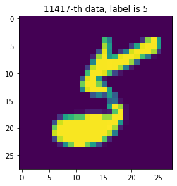
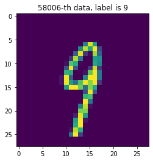
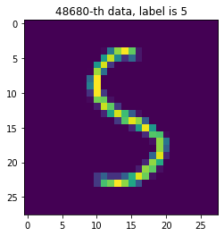
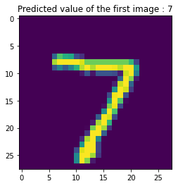

# MNIST 데이터셋 다운받기


```python
from tensorflow.keras.datasets.mnist import load_data

(x_train, y_train), (x_test, y_test) = load_data(path='mnist.npz')
```

# 데이터의 형태 확인하기


```python
print(x_train.shape, y_train.shape)
print(y_train)
print(x_test.shape, y_test.shape)
print(y_test)
```

    (60000, 28, 28) (60000,)
    [5 0 4 ... 5 6 8]
    (10000, 28, 28) (10000,)
    [7 2 1 ... 4 5 6]
    

x_train: 60000만개의 숫자이미지 데이터
y_train: 60000만개의 숫자 레이블

# 데이터 그려보기


```python
import matplotlib.pyplot as plt
import numpy as np

sample_size = 3

random_idx = np.random.randint(60000, size=sample_size)

for idx in random_idx:
    img = x_train[idx, :]
    label = y_train[idx]
    plt.figure()
    plt.imshow(img)
    plt.title('%d-th data, label is %d' % (idx, label))
```


    

    


    

    


    

    


# 검증 데이터 만들기


```python
from sklearn.model_selection import train_test_split

#훈련/테스트 데이터를 7:3 비율로 분리

x_train, x_val, y_train, y_val = train_test_split(x_train, y_train, 
                                                  test_size = 0.3, 
                                                  random_state = 777)
print(f'훈련 데이터 {x_train.shape} 레이블 {y_train.shape}')
print(f'검증 데이터 {x_val.shape} 레이블 {y_val.shape}')
```

    훈련 데이터 (42000, 28, 28) 레이블 (42000,)
    검증 데이터 (18000, 28, 28) 레이블 (18000,)
    

# 모델 입력을 위한 데이터 전처리


```python
num_x_train = x_train.shape[0]
num_x_val = x_val.shape[0]
num_x_test = x_test.shape[0]

#모델의 입력으로 사용하기 위한 전처리 과정
x_train = (x_train.reshape((num_x_train, 28* 28))) / 255
x_val = (x_val.reshape((num_x_val, 28* 28))) / 255
x_test = (x_test.reshape((num_x_test, 28* 28))) / 255

print(x_train.shape)
print(x_val.shape)
print(x_test.shape)
```

    (42000, 784)
    (18000, 784)
    (10000, 784)
    

# 모델 입력을 위한 레이블 전처리


```python
from tensorflow.keras.utils import to_categorical

y_train = to_categorical(y_train)
y_val = to_categorical(y_val)
y_test = to_categorical(y_test)

print(y_train)
```

    [[0. 0. 1. ... 0. 0. 0.]
     [0. 0. 0. ... 1. 0. 0.]
     [0. 0. 0. ... 0. 0. 0.]
     ...
     [0. 0. 0. ... 0. 0. 0.]
     [0. 0. 0. ... 0. 0. 0.]
     [0. 0. 0. ... 0. 0. 0.]]
    

# 모델 구성하기


```python
from tensorflow.keras.models import Sequential
from tensorflow.keras.layers import Dense

model = Sequential()

#784 차원의 데이터를 입력으로 받고, 64개의 출력층을 가지는 첫번째 Dense 층
model.add(Dense(64, activation = 'relu', input_shape = (784, )))
model.add(Dense(32, activation = 'relu')) #32개의 출력을 가지는 Dense 층
model.add(Dense(10, activation = 'softmax'))  # 10개의 출력을 가지는 신경망

# 범주형 데이터를 다루기 때문에 마지막 층에서 소프트맥스 함수를 사용

model.compile(optimizer='adam',
             loss = 'categorical_crossentropy',
             metrics=['acc'])


```

# 모델 학습하기


```python
history = model.fit(x_train, y_train, epochs = 30, batch_size = 128, validation_data = (x_val, y_val))
```

    Epoch 1/30
    329/329 [==============================] - 3s 6ms/step - loss: 0.9145 - acc: 0.7296 - val_loss: 0.2530 - val_acc: 0.9273
    Epoch 2/30
    329/329 [==============================] - 1s 3ms/step - loss: 0.2284 - acc: 0.9318 - val_loss: 0.1946 - val_acc: 0.9441
    Epoch 3/30
    329/329 [==============================] - 1s 3ms/step - loss: 0.1668 - acc: 0.9517 - val_loss: 0.1627 - val_acc: 0.9526
    Epoch 4/30
    329/329 [==============================] - 1s 3ms/step - loss: 0.1289 - acc: 0.9636 - val_loss: 0.1427 - val_acc: 0.9584
    Epoch 5/30
    329/329 [==============================] - 1s 2ms/step - loss: 0.1050 - acc: 0.9699 - val_loss: 0.1359 - val_acc: 0.9583
    Epoch 6/30
    329/329 [==============================] - 1s 2ms/step - loss: 0.0917 - acc: 0.9734 - val_loss: 0.1226 - val_acc: 0.9637
    Epoch 7/30
    329/329 [==============================] - 1s 3ms/step - loss: 0.0798 - acc: 0.9772 - val_loss: 0.1165 - val_acc: 0.9645
    Epoch 8/30
    329/329 [==============================] - 1s 3ms/step - loss: 0.0686 - acc: 0.9805 - val_loss: 0.1133 - val_acc: 0.9664
    Epoch 9/30
    329/329 [==============================] - 1s 2ms/step - loss: 0.0604 - acc: 0.9835 - val_loss: 0.1153 - val_acc: 0.9647
    Epoch 10/30
    329/329 [==============================] - 1s 3ms/step - loss: 0.0532 - acc: 0.9847 - val_loss: 0.1051 - val_acc: 0.9687
    Epoch 11/30
    329/329 [==============================] - 1s 2ms/step - loss: 0.0466 - acc: 0.9863 - val_loss: 0.1076 - val_acc: 0.9681
    Epoch 12/30
    329/329 [==============================] - 1s 3ms/step - loss: 0.0425 - acc: 0.9873 - val_loss: 0.1064 - val_acc: 0.9683
    Epoch 13/30
    329/329 [==============================] - 1s 3ms/step - loss: 0.0363 - acc: 0.9900 - val_loss: 0.1103 - val_acc: 0.9677
    Epoch 14/30
    329/329 [==============================] - 1s 2ms/step - loss: 0.0338 - acc: 0.9902 - val_loss: 0.1160 - val_acc: 0.9654
    Epoch 15/30
    329/329 [==============================] - 1s 2ms/step - loss: 0.0304 - acc: 0.9909 - val_loss: 0.1159 - val_acc: 0.9676
    Epoch 16/30
    329/329 [==============================] - 1s 3ms/step - loss: 0.0253 - acc: 0.9931 - val_loss: 0.1182 - val_acc: 0.9671
    Epoch 17/30
    329/329 [==============================] - 1s 3ms/step - loss: 0.0222 - acc: 0.9936 - val_loss: 0.1097 - val_acc: 0.9690
    Epoch 18/30
    329/329 [==============================] - 1s 3ms/step - loss: 0.0196 - acc: 0.9947 - val_loss: 0.1126 - val_acc: 0.9694
    Epoch 19/30
    329/329 [==============================] - 1s 3ms/step - loss: 0.0171 - acc: 0.9958 - val_loss: 0.1103 - val_acc: 0.9703
    Epoch 20/30
    329/329 [==============================] - 1s 3ms/step - loss: 0.0160 - acc: 0.9959 - val_loss: 0.1189 - val_acc: 0.9701
    Epoch 21/30
    329/329 [==============================] - 1s 3ms/step - loss: 0.0150 - acc: 0.9962 - val_loss: 0.1173 - val_acc: 0.9697
    Epoch 22/30
    329/329 [==============================] - 1s 2ms/step - loss: 0.0121 - acc: 0.9969 - val_loss: 0.1163 - val_acc: 0.9711
    Epoch 23/30
    329/329 [==============================] - 1s 3ms/step - loss: 0.0100 - acc: 0.9979 - val_loss: 0.1202 - val_acc: 0.9712
    Epoch 24/30
    329/329 [==============================] - 1s 3ms/step - loss: 0.0130 - acc: 0.9969 - val_loss: 0.1336 - val_acc: 0.9679
    Epoch 25/30
    329/329 [==============================] - 1s 2ms/step - loss: 0.0117 - acc: 0.9967 - val_loss: 0.1321 - val_acc: 0.9704
    Epoch 26/30
    329/329 [==============================] - 1s 3ms/step - loss: 0.0091 - acc: 0.9982 - val_loss: 0.1275 - val_acc: 0.9708
    Epoch 27/30
    329/329 [==============================] - 1s 3ms/step - loss: 0.0051 - acc: 0.9992 - val_loss: 0.1353 - val_acc: 0.9695
    Epoch 28/30
    329/329 [==============================] - 1s 3ms/step - loss: 0.0064 - acc: 0.9985 - val_loss: 0.1504 - val_acc: 0.9672
    Epoch 29/30
    329/329 [==============================] - 1s 3ms/step - loss: 0.0101 - acc: 0.9973 - val_loss: 0.1452 - val_acc: 0.9686
    Epoch 30/30
    329/329 [==============================] - 1s 3ms/step - loss: 0.0073 - acc: 0.9981 - val_loss: 0.1426 - val_acc: 0.9683
    

# history를 통해 확인해볼 수 있는 값 출력


```python
history.history.keys()
```


    dict_keys(['loss', 'acc', 'val_loss', 'val_acc'])


# 학습 결과 그려보기


```python
import matplotlib.pyplot as plt

his_dict = history.history
loss = his_dict['loss']
val_loss = his_dict['val_loss']

epochs = range(1, len(loss)+1)
fig = plt.figure (figsize = (10,5))

#학습 및 검증 손실
ax1= fig.add_subplot(1,2,1)
ax1.plot(epochs, loss, color = 'blue', label = 'train_loss')
ax1.plot(epochs, val_loss, color = 'orange', label = 'val_loss')
ax1.set_title('train and val loss')
ax1.set_xlabel('epochs')
ax1.set_ylabel('loss')
ax1.legend()


acc= his_dict['acc']
val_acc = his_dict['val_acc']

#학습 및 검증 정확도
ax2 = fig.add_subplot(1,2,2)
ax2.plot(epochs, acc, color = 'blue', label = 'train_acc')
ax2.plot(epochs, val_acc, color = 'orange', label = 'val_acc')
ax2.set_title('train and val acc')
ax2.set_xlabel('epochs')
ax2.set_ylabel('acc')
ax2.legend()


plt.show()
```


    

    


# 모델 평가하기


```python
model.evaluate(x_test,y_test)
```

    313/313 [==============================] - 0s 1ms/step - loss: 0.1395 - acc: 0.9717
    


    [0.13950173556804657, 0.9717000126838684]


[손실값, 정확도]

# 학습된 모델을 통해 값 예측하기


```python
import numpy as np

results = model.predict(x_test)
print(results.shape)
np.set_printoptions(precision=7) #numpy 소수점 제한

print(f' 각 클래스에 속할 확률 : \n{results [0]}')

```

    (10000, 10)
     각 클래스에 속할 확률 : 
    [7.0894500e-13 1.3015682e-13 4.3996355e-11 5.7532703e-09 1.9943781e-19
     1.2586013e-12 5.8566056e-23 1.0000000e+00 1.0338789e-15 4.2242481e-12]
    

# 예측값 그려서 확인해보기


```python
import matplotlib.pyplot as plt

arg_results = np.argmax(results, axis = -1) #가장 큰 값의 인덱스를 가져옴
plt.imshow(x_test[0].reshape(28,28))
plt.title('Predicted value of the first image : ' + str(arg_results[0]))

plt.show()

```


    

    


# 모델 평가 방법 1 - 혼동 행렬(Confusion Matrix)


```python
from sklearn.metrics import classification_report, confusion_matrix
import matplotlib.pyplot as plt
import seaborn as sns


#혼동행렬 만들기

plt.figure(figsize = (7,7))
cm = confusion_matrix(np.argmax(y_test, axis = -1), np.argmax(results, axis = -1))
sns.heatmap(cm, annot = True, fmt = 'd', cmap = 'Blues')
plt.xlabel('predicted label')
plt.ylabel('true label')
plt.show()
```


    

    


# 모델 평가 방법 2 - 분류 보고서


```python
print(classification_report(np.argmax(y_test, axis = -1),np.argmax(results, axis = -1)))
```

                  precision    recall  f1-score   support
    
               0       0.97      0.99      0.98       980
               1       0.97      0.99      0.98      1135
               2       0.97      0.97      0.97      1032
               3       0.96      0.97      0.97      1010
               4       0.98      0.97      0.97       982
               5       0.98      0.96      0.97       892
               6       0.98      0.97      0.98       958
               7       0.97      0.97      0.97      1028
               8       0.99      0.93      0.96       974
               9       0.95      0.97      0.96      1009
    
        accuracy                           0.97     10000
       macro avg       0.97      0.97      0.97     10000
    weighted avg       0.97      0.97      0.97     10000
    
    
