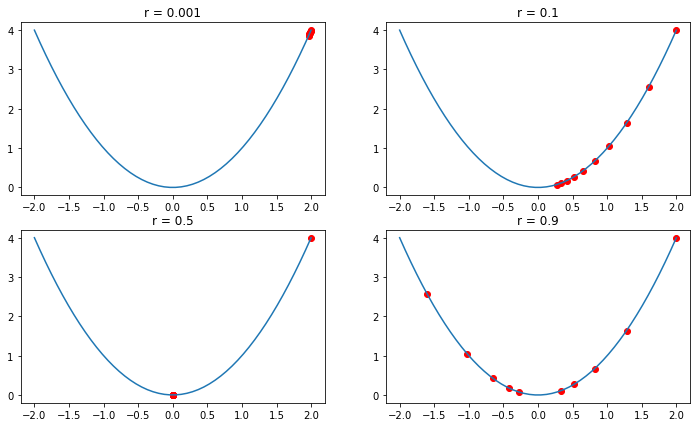

```python
import tensorflow as tf
import numpy as np

a = tf.constant([1,2,3])
b=a.numpy()
print(a)
print(a.numpy())
print(np.square(b))
c=np.square(b)
c_tensor=tf.convert_to_tensor(c)

print(c_tensor)
```

    tf.Tensor([1 2 3], shape=(3,), dtype=int32)
    [1 2 3]
    [1 4 9]
    tf.Tensor([1 4 9], shape=(3,), dtype=int32)
    

# OR 게이트 구현해보기


```python
import tensorflow as tf
tf.random.set_seed(777)

import numpy as np
from tensorflow.keras.models import Sequential
from tensorflow.keras.layers import Dense
from tensorflow.keras.optimizers import SGD
from tensorflow.keras.losses import mse

x = np.array([ [0,0], [1,0], [0,1], [1,1] ])
y = np.array([[0],[1],[1],[1]])

model=Sequential()
model.add(Dense(1, input_shape=(2, ), activation = 'linear'))
model.compile(optimizer = SGD(), loss = mse, metrics = ['acc'])

model.fit(x, y, epochs=500)

```

    Epoch 1/500
    1/1 [==============================] - 0s 451ms/step - loss: 1.4290 - acc: 0.5000
    Epoch 2/500
    1/1 [==============================] - 0s 6ms/step - loss: 1.3602 - acc: 0.5000
    Epoch 3/500
    1/1 [==============================] - 0s 5ms/step - loss: 1.2956 - acc: 0.5000
    Epoch 4/500
    1/1 [==============================] - 0s 6ms/step - loss: 1.2349 - acc: 0.5000
    Epoch 5/500
    1/1 [==============================] - 0s 5ms/step - loss: 1.1779 - acc: 0.5000
    Epoch 6/500
    1/1 [==============================] - 0s 6ms/step - loss: 1.1242 - acc: 0.5000
    Epoch 7/500
    1/1 [==============================] - 0s 6ms/step - loss: 1.0738 - acc: 0.5000
    Epoch 8/500
    1/1 [==============================] - 0s 5ms/step - loss: 1.0264 - acc: 0.5000
    Epoch 9/500
    1/1 [==============================] - 0s 5ms/step - loss: 0.9819 - acc: 0.5000
    Epoch 10/500
    1/1 [==============================] - 0s 6ms/step - loss: 0.9399 - acc: 0.5000
    Epoch 11/500
    1/1 [==============================] - 0s 6ms/step - loss: 0.9005 - acc: 0.5000
    Epoch 12/500
    1/1 [==============================] - 0s 6ms/step - loss: 0.8634 - acc: 0.5000
    Epoch 13/500
    1/1 [==============================] - 0s 6ms/step - loss: 0.8284 - acc: 0.5000
    Epoch 14/500
    1/1 [==============================] - 0s 6ms/step - loss: 0.7955 - acc: 0.5000
    Epoch 15/500
    1/1 [==============================] - 0s 5ms/step - loss: 0.7646 - acc: 0.5000
    Epoch 16/500
    1/1 [==============================] - 0s 5ms/step - loss: 0.7354 - acc: 0.5000
    Epoch 17/500
    1/1 [==============================] - 0s 6ms/step - loss: 0.7079 - acc: 0.5000
    Epoch 18/500
    1/1 [==============================] - 0s 5ms/step - loss: 0.6820 - acc: 0.5000
    Epoch 19/500
    1/1 [==============================] - 0s 4ms/step - loss: 0.6576 - acc: 0.5000
    Epoch 20/500
    1/1 [==============================] - 0s 5ms/step - loss: 0.6346 - acc: 0.5000
    Epoch 21/500
    1/1 [==============================] - 0s 4ms/step - loss: 0.6129 - acc: 0.5000
    Epoch 22/500
    1/1 [==============================] - 0s 7ms/step - loss: 0.5925 - acc: 0.5000
    Epoch 23/500
    1/1 [==============================] - 0s 6ms/step - loss: 0.5732 - acc: 0.5000
    Epoch 24/500
    1/1 [==============================] - 0s 7ms/step - loss: 0.5549 - acc: 0.5000
    Epoch 25/500
    1/1 [==============================] - 0s 6ms/step - loss: 0.5377 - acc: 0.5000
    Epoch 26/500
    1/1 [==============================] - 0s 5ms/step - loss: 0.5215 - acc: 0.5000
    Epoch 27/500
    1/1 [==============================] - 0s 6ms/step - loss: 0.5061 - acc: 0.5000
    Epoch 28/500
    1/1 [==============================] - 0s 6ms/step - loss: 0.4916 - acc: 0.5000
    Epoch 29/500
    1/1 [==============================] - 0s 6ms/step - loss: 0.4778 - acc: 0.5000
    Epoch 30/500
    1/1 [==============================] - 0s 5ms/step - loss: 0.4648 - acc: 0.5000
    Epoch 31/500
    1/1 [==============================] - 0s 7ms/step - loss: 0.4525 - acc: 0.7500
    Epoch 32/500
    1/1 [==============================] - 0s 6ms/step - loss: 0.4409 - acc: 0.7500
    Epoch 33/500
    1/1 [==============================] - 0s 5ms/step - loss: 0.4298 - acc: 0.7500
    Epoch 34/500
    1/1 [==============================] - 0s 6ms/step - loss: 0.4193 - acc: 0.7500
    Epoch 35/500
    1/1 [==============================] - 0s 5ms/step - loss: 0.4094 - acc: 0.7500
    Epoch 36/500
    1/1 [==============================] - 0s 5ms/step - loss: 0.4000 - acc: 0.7500
    Epoch 37/500
    1/1 [==============================] - 0s 6ms/step - loss: 0.3911 - acc: 0.7500
    Epoch 38/500
    1/1 [==============================] - 0s 5ms/step - loss: 0.3826 - acc: 0.7500
    Epoch 39/500
    1/1 [==============================] - 0s 5ms/step - loss: 0.3745 - acc: 0.7500
    Epoch 40/500
    1/1 [==============================] - 0s 6ms/step - loss: 0.3668 - acc: 0.7500
    Epoch 41/500
    1/1 [==============================] - 0s 6ms/step - loss: 0.3595 - acc: 0.7500
    Epoch 42/500
    1/1 [==============================] - 0s 6ms/step - loss: 0.3525 - acc: 0.7500
    Epoch 43/500
    1/1 [==============================] - 0s 6ms/step - loss: 0.3459 - acc: 0.7500
    Epoch 44/500
    1/1 [==============================] - 0s 6ms/step - loss: 0.3396 - acc: 0.7500
    Epoch 45/500
    1/1 [==============================] - 0s 6ms/step - loss: 0.3336 - acc: 0.7500
    Epoch 46/500
    1/1 [==============================] - 0s 7ms/step - loss: 0.3278 - acc: 0.7500
    Epoch 47/500
    1/1 [==============================] - 0s 7ms/step - loss: 0.3223 - acc: 0.7500
    Epoch 48/500
    1/1 [==============================] - 0s 7ms/step - loss: 0.3170 - acc: 0.7500
    Epoch 49/500
    1/1 [==============================] - 0s 7ms/step - loss: 0.3120 - acc: 0.7500
    Epoch 50/500
    1/1 [==============================] - 0s 6ms/step - loss: 0.3072 - acc: 0.7500
    Epoch 51/500
    1/1 [==============================] - 0s 7ms/step - loss: 0.3026 - acc: 0.7500
    Epoch 52/500
    1/1 [==============================] - 0s 6ms/step - loss: 0.2982 - acc: 0.7500
    Epoch 53/500
    1/1 [==============================] - 0s 6ms/step - loss: 0.2939 - acc: 0.7500
    Epoch 54/500
    1/1 [==============================] - 0s 7ms/step - loss: 0.2898 - acc: 0.7500
    Epoch 55/500
    1/1 [==============================] - 0s 8ms/step - loss: 0.2859 - acc: 0.7500
    Epoch 56/500
    1/1 [==============================] - 0s 6ms/step - loss: 0.2822 - acc: 0.7500
    Epoch 57/500
    1/1 [==============================] - 0s 6ms/step - loss: 0.2785 - acc: 0.7500
    Epoch 58/500
    1/1 [==============================] - 0s 9ms/step - loss: 0.2750 - acc: 0.7500
    Epoch 59/500
    1/1 [==============================] - 0s 8ms/step - loss: 0.2717 - acc: 0.7500
    Epoch 60/500
    1/1 [==============================] - 0s 8ms/step - loss: 0.2684 - acc: 0.7500
    Epoch 61/500
    1/1 [==============================] - 0s 7ms/step - loss: 0.2653 - acc: 0.7500
    Epoch 62/500
    1/1 [==============================] - 0s 7ms/step - loss: 0.2623 - acc: 0.7500
    Epoch 63/500
    1/1 [==============================] - 0s 6ms/step - loss: 0.2594 - acc: 0.7500
    Epoch 64/500
    1/1 [==============================] - 0s 6ms/step - loss: 0.2565 - acc: 0.7500
    Epoch 65/500
    1/1 [==============================] - 0s 7ms/step - loss: 0.2538 - acc: 0.7500
    Epoch 66/500
    1/1 [==============================] - 0s 5ms/step - loss: 0.2511 - acc: 0.7500
    Epoch 67/500
    1/1 [==============================] - 0s 6ms/step - loss: 0.2486 - acc: 0.7500
    Epoch 68/500
    1/1 [==============================] - 0s 6ms/step - loss: 0.2461 - acc: 0.7500
    Epoch 69/500
    1/1 [==============================] - 0s 5ms/step - loss: 0.2436 - acc: 0.7500
    Epoch 70/500
    1/1 [==============================] - 0s 5ms/step - loss: 0.2413 - acc: 0.7500
    Epoch 71/500
    1/1 [==============================] - 0s 5ms/step - loss: 0.2390 - acc: 0.7500
    Epoch 72/500
    1/1 [==============================] - 0s 5ms/step - loss: 0.2368 - acc: 0.7500
    Epoch 73/500
    1/1 [==============================] - 0s 6ms/step - loss: 0.2346 - acc: 0.7500
    Epoch 74/500
    1/1 [==============================] - 0s 5ms/step - loss: 0.2325 - acc: 0.7500
    Epoch 75/500
    1/1 [==============================] - 0s 5ms/step - loss: 0.2304 - acc: 0.7500
    Epoch 76/500
    1/1 [==============================] - 0s 5ms/step - loss: 0.2284 - acc: 0.7500
    Epoch 77/500
    1/1 [==============================] - 0s 5ms/step - loss: 0.2264 - acc: 0.7500
    Epoch 78/500
    1/1 [==============================] - 0s 6ms/step - loss: 0.2245 - acc: 0.7500
    Epoch 79/500
    1/1 [==============================] - 0s 5ms/step - loss: 0.2226 - acc: 0.7500
    Epoch 80/500
    1/1 [==============================] - 0s 6ms/step - loss: 0.2208 - acc: 0.7500
    Epoch 81/500
    1/1 [==============================] - 0s 6ms/step - loss: 0.2190 - acc: 0.7500
    Epoch 82/500
    1/1 [==============================] - 0s 6ms/step - loss: 0.2173 - acc: 0.7500
    Epoch 83/500
    1/1 [==============================] - 0s 5ms/step - loss: 0.2155 - acc: 0.7500
    Epoch 84/500
    1/1 [==============================] - 0s 5ms/step - loss: 0.2139 - acc: 0.7500
    Epoch 85/500
    1/1 [==============================] - 0s 5ms/step - loss: 0.2122 - acc: 0.7500
    Epoch 86/500
    1/1 [==============================] - 0s 6ms/step - loss: 0.2106 - acc: 0.7500
    Epoch 87/500
    1/1 [==============================] - 0s 5ms/step - loss: 0.2090 - acc: 0.7500
    Epoch 88/500
    1/1 [==============================] - 0s 5ms/step - loss: 0.2074 - acc: 0.7500
    Epoch 89/500
    1/1 [==============================] - 0s 5ms/step - loss: 0.2059 - acc: 0.7500
    Epoch 90/500
    1/1 [==============================] - 0s 6ms/step - loss: 0.2044 - acc: 0.7500
    Epoch 91/500
    1/1 [==============================] - 0s 6ms/step - loss: 0.2029 - acc: 0.7500
    Epoch 92/500
    1/1 [==============================] - 0s 6ms/step - loss: 0.2015 - acc: 0.7500
    Epoch 93/500
    1/1 [==============================] - 0s 5ms/step - loss: 0.2000 - acc: 0.7500
    Epoch 94/500
    1/1 [==============================] - 0s 5ms/step - loss: 0.1986 - acc: 0.7500
    Epoch 95/500
    1/1 [==============================] - 0s 6ms/step - loss: 0.1973 - acc: 0.7500
    Epoch 96/500
    1/1 [==============================] - 0s 5ms/step - loss: 0.1959 - acc: 0.7500
    Epoch 97/500
    1/1 [==============================] - 0s 5ms/step - loss: 0.1946 - acc: 0.7500
    Epoch 98/500
    1/1 [==============================] - ETA: 0s - loss: 0.1932 - acc: 0.750 - 0s 5ms/step - loss: 0.1932 - acc: 0.7500
    Epoch 99/500
    1/1 [==============================] - 0s 5ms/step - loss: 0.1919 - acc: 0.7500
    Epoch 100/500
    1/1 [==============================] - 0s 5ms/step - loss: 0.1907 - acc: 0.7500
    Epoch 101/500
    1/1 [==============================] - 0s 6ms/step - loss: 0.1894 - acc: 0.7500
    Epoch 102/500
    1/1 [==============================] - 0s 5ms/step - loss: 0.1881 - acc: 0.7500
    Epoch 103/500
    1/1 [==============================] - 0s 6ms/step - loss: 0.1869 - acc: 0.7500
    Epoch 104/500
    1/1 [==============================] - 0s 6ms/step - loss: 0.1857 - acc: 0.7500
    Epoch 105/500
    1/1 [==============================] - 0s 5ms/step - loss: 0.1845 - acc: 0.7500
    Epoch 106/500
    1/1 [==============================] - 0s 5ms/step - loss: 0.1833 - acc: 0.7500
    Epoch 107/500
    1/1 [==============================] - 0s 6ms/step - loss: 0.1822 - acc: 0.7500
    Epoch 108/500
    1/1 [==============================] - 0s 5ms/step - loss: 0.1810 - acc: 0.7500
    Epoch 109/500
    1/1 [==============================] - 0s 5ms/step - loss: 0.1799 - acc: 0.7500
    Epoch 110/500
    1/1 [==============================] - 0s 5ms/step - loss: 0.1787 - acc: 0.7500
    Epoch 111/500
    1/1 [==============================] - 0s 5ms/step - loss: 0.1776 - acc: 0.7500
    Epoch 112/500
    1/1 [==============================] - 0s 6ms/step - loss: 0.1765 - acc: 0.7500
    Epoch 113/500
    1/1 [==============================] - 0s 5ms/step - loss: 0.1755 - acc: 0.7500
    Epoch 114/500
    1/1 [==============================] - 0s 5ms/step - loss: 0.1744 - acc: 0.7500
    Epoch 115/500
    1/1 [==============================] - 0s 5ms/step - loss: 0.1733 - acc: 0.7500
    Epoch 116/500
    1/1 [==============================] - 0s 4ms/step - loss: 0.1723 - acc: 0.7500
    Epoch 117/500
    1/1 [==============================] - 0s 6ms/step - loss: 0.1712 - acc: 0.7500
    Epoch 118/500
    1/1 [==============================] - 0s 6ms/step - loss: 0.1702 - acc: 0.7500
    Epoch 119/500
    1/1 [==============================] - 0s 5ms/step - loss: 0.1692 - acc: 0.7500
    Epoch 120/500
    1/1 [==============================] - 0s 5ms/step - loss: 0.1682 - acc: 0.7500
    Epoch 121/500
    1/1 [==============================] - 0s 6ms/step - loss: 0.1672 - acc: 0.7500
    Epoch 122/500
    1/1 [==============================] - 0s 5ms/step - loss: 0.1663 - acc: 0.7500
    Epoch 123/500
    1/1 [==============================] - 0s 6ms/step - loss: 0.1653 - acc: 0.7500
    Epoch 124/500
    1/1 [==============================] - 0s 6ms/step - loss: 0.1643 - acc: 0.7500
    Epoch 125/500
    1/1 [==============================] - 0s 5ms/step - loss: 0.1634 - acc: 0.7500
    Epoch 126/500
    1/1 [==============================] - 0s 5ms/step - loss: 0.1625 - acc: 0.7500
    Epoch 127/500
    1/1 [==============================] - 0s 5ms/step - loss: 0.1615 - acc: 0.7500
    Epoch 128/500
    1/1 [==============================] - 0s 5ms/step - loss: 0.1606 - acc: 0.7500
    Epoch 129/500
    1/1 [==============================] - 0s 5ms/step - loss: 0.1597 - acc: 0.7500
    Epoch 130/500
    1/1 [==============================] - 0s 5ms/step - loss: 0.1588 - acc: 0.7500
    Epoch 131/500
    1/1 [==============================] - 0s 6ms/step - loss: 0.1579 - acc: 0.7500
    Epoch 132/500
    1/1 [==============================] - 0s 6ms/step - loss: 0.1570 - acc: 0.7500
    Epoch 133/500
    1/1 [==============================] - 0s 5ms/step - loss: 0.1562 - acc: 0.7500
    Epoch 134/500
    1/1 [==============================] - 0s 5ms/step - loss: 0.1553 - acc: 0.7500
    Epoch 135/500
    1/1 [==============================] - 0s 5ms/step - loss: 0.1545 - acc: 0.7500
    Epoch 136/500
    1/1 [==============================] - 0s 5ms/step - loss: 0.1536 - acc: 0.7500
    Epoch 137/500
    1/1 [==============================] - 0s 5ms/step - loss: 0.1528 - acc: 0.7500
    Epoch 138/500
    1/1 [==============================] - 0s 5ms/step - loss: 0.1520 - acc: 0.7500
    Epoch 139/500
    1/1 [==============================] - 0s 6ms/step - loss: 0.1511 - acc: 0.7500
    Epoch 140/500
    1/1 [==============================] - 0s 6ms/step - loss: 0.1503 - acc: 0.7500
    Epoch 141/500
    1/1 [==============================] - 0s 5ms/step - loss: 0.1495 - acc: 0.7500
    Epoch 142/500
    1/1 [==============================] - 0s 5ms/step - loss: 0.1487 - acc: 0.7500
    Epoch 143/500
    1/1 [==============================] - 0s 5ms/step - loss: 0.1480 - acc: 0.7500
    Epoch 144/500
    1/1 [==============================] - 0s 5ms/step - loss: 0.1472 - acc: 0.7500
    Epoch 145/500
    1/1 [==============================] - 0s 6ms/step - loss: 0.1464 - acc: 0.7500
    Epoch 146/500
    1/1 [==============================] - 0s 5ms/step - loss: 0.1456 - acc: 0.7500
    Epoch 147/500
    1/1 [==============================] - 0s 6ms/step - loss: 0.1449 - acc: 0.7500
    Epoch 148/500
    1/1 [==============================] - 0s 5ms/step - loss: 0.1441 - acc: 0.7500
    Epoch 149/500
    1/1 [==============================] - 0s 6ms/step - loss: 0.1434 - acc: 0.7500
    Epoch 150/500
    1/1 [==============================] - 0s 4ms/step - loss: 0.1427 - acc: 0.7500
    Epoch 151/500
    1/1 [==============================] - 0s 5ms/step - loss: 0.1419 - acc: 0.7500
    Epoch 152/500
    1/1 [==============================] - 0s 5ms/step - loss: 0.1412 - acc: 0.7500
    Epoch 153/500
    1/1 [==============================] - 0s 5ms/step - loss: 0.1405 - acc: 0.7500
    Epoch 154/500
    1/1 [==============================] - 0s 6ms/step - loss: 0.1398 - acc: 0.7500
    Epoch 155/500
    1/1 [==============================] - 0s 5ms/step - loss: 0.1391 - acc: 0.7500
    Epoch 156/500
    1/1 [==============================] - 0s 7ms/step - loss: 0.1384 - acc: 0.7500
    Epoch 157/500
    1/1 [==============================] - 0s 5ms/step - loss: 0.1377 - acc: 0.7500
    Epoch 158/500
    1/1 [==============================] - 0s 5ms/step - loss: 0.1370 - acc: 0.7500
    Epoch 159/500
    1/1 [==============================] - 0s 5ms/step - loss: 0.1364 - acc: 0.7500
    Epoch 160/500
    1/1 [==============================] - 0s 7ms/step - loss: 0.1357 - acc: 0.7500
    Epoch 161/500
    1/1 [==============================] - 0s 6ms/step - loss: 0.1350 - acc: 0.7500
    Epoch 162/500
    1/1 [==============================] - 0s 6ms/step - loss: 0.1344 - acc: 0.7500
    Epoch 163/500
    1/1 [==============================] - 0s 6ms/step - loss: 0.1337 - acc: 0.7500
    Epoch 164/500
    1/1 [==============================] - 0s 6ms/step - loss: 0.1331 - acc: 0.7500
    Epoch 165/500
    1/1 [==============================] - 0s 8ms/step - loss: 0.1325 - acc: 0.7500
    Epoch 166/500
    1/1 [==============================] - 0s 6ms/step - loss: 0.1318 - acc: 0.7500
    Epoch 167/500
    1/1 [==============================] - 0s 7ms/step - loss: 0.1312 - acc: 0.7500
    Epoch 168/500
    1/1 [==============================] - 0s 6ms/step - loss: 0.1306 - acc: 0.7500
    Epoch 169/500
    1/1 [==============================] - 0s 6ms/step - loss: 0.1300 - acc: 0.7500
    Epoch 170/500
    1/1 [==============================] - 0s 5ms/step - loss: 0.1294 - acc: 0.7500
    Epoch 171/500
    1/1 [==============================] - 0s 5ms/step - loss: 0.1288 - acc: 0.7500
    Epoch 172/500
    1/1 [==============================] - 0s 6ms/step - loss: 0.1282 - acc: 0.7500
    Epoch 173/500
    1/1 [==============================] - 0s 7ms/step - loss: 0.1276 - acc: 0.7500
    Epoch 174/500
    1/1 [==============================] - 0s 6ms/step - loss: 0.1270 - acc: 0.7500
    Epoch 175/500
    1/1 [==============================] - 0s 10ms/step - loss: 0.1264 - acc: 0.7500
    Epoch 176/500
    1/1 [==============================] - 0s 7ms/step - loss: 0.1258 - acc: 0.7500
    Epoch 177/500
    1/1 [==============================] - 0s 5ms/step - loss: 0.1253 - acc: 0.7500
    Epoch 178/500
    1/1 [==============================] - 0s 5ms/step - loss: 0.1247 - acc: 0.7500
    Epoch 179/500
    1/1 [==============================] - 0s 5ms/step - loss: 0.1242 - acc: 0.7500
    Epoch 180/500
    1/1 [==============================] - 0s 6ms/step - loss: 0.1236 - acc: 0.7500
    Epoch 181/500
    1/1 [==============================] - 0s 6ms/step - loss: 0.1231 - acc: 0.7500
    Epoch 182/500
    1/1 [==============================] - 0s 4ms/step - loss: 0.1225 - acc: 0.7500
    Epoch 183/500
    1/1 [==============================] - 0s 6ms/step - loss: 0.1220 - acc: 0.7500
    Epoch 184/500
    1/1 [==============================] - 0s 5ms/step - loss: 0.1214 - acc: 0.7500
    Epoch 185/500
    1/1 [==============================] - 0s 6ms/step - loss: 0.1209 - acc: 0.7500
    Epoch 186/500
    1/1 [==============================] - 0s 6ms/step - loss: 0.1204 - acc: 0.7500
    Epoch 187/500
    1/1 [==============================] - 0s 6ms/step - loss: 0.1199 - acc: 0.7500
    Epoch 188/500
    1/1 [==============================] - 0s 8ms/step - loss: 0.1194 - acc: 0.7500
    Epoch 189/500
    1/1 [==============================] - 0s 5ms/step - loss: 0.1189 - acc: 0.7500
    Epoch 190/500
    1/1 [==============================] - 0s 6ms/step - loss: 0.1184 - acc: 0.7500
    Epoch 191/500
    1/1 [==============================] - 0s 6ms/step - loss: 0.1179 - acc: 0.7500
    Epoch 192/500
    1/1 [==============================] - 0s 6ms/step - loss: 0.1174 - acc: 1.0000
    Epoch 193/500
    1/1 [==============================] - 0s 5ms/step - loss: 0.1169 - acc: 1.0000
    Epoch 194/500
    1/1 [==============================] - 0s 6ms/step - loss: 0.1164 - acc: 1.0000
    Epoch 195/500
    1/1 [==============================] - 0s 4ms/step - loss: 0.1159 - acc: 1.0000
    Epoch 196/500
    1/1 [==============================] - 0s 7ms/step - loss: 0.1154 - acc: 1.0000
    Epoch 197/500
    1/1 [==============================] - 0s 5ms/step - loss: 0.1150 - acc: 1.0000
    Epoch 198/500
    1/1 [==============================] - 0s 5ms/step - loss: 0.1145 - acc: 1.0000
    Epoch 199/500
    1/1 [==============================] - 0s 5ms/step - loss: 0.1140 - acc: 1.0000
    Epoch 200/500
    1/1 [==============================] - 0s 5ms/step - loss: 0.1136 - acc: 1.0000
    Epoch 201/500
    1/1 [==============================] - 0s 5ms/step - loss: 0.1131 - acc: 1.0000
    Epoch 202/500
    1/1 [==============================] - 0s 6ms/step - loss: 0.1127 - acc: 1.0000
    Epoch 203/500
    1/1 [==============================] - 0s 5ms/step - loss: 0.1122 - acc: 1.0000
    Epoch 204/500
    1/1 [==============================] - 0s 5ms/step - loss: 0.1118 - acc: 1.0000
    Epoch 205/500
    1/1 [==============================] - 0s 5ms/step - loss: 0.1114 - acc: 1.0000
    Epoch 206/500
    1/1 [==============================] - 0s 5ms/step - loss: 0.1109 - acc: 1.0000
    Epoch 207/500
    1/1 [==============================] - 0s 5ms/step - loss: 0.1105 - acc: 1.0000
    Epoch 208/500
    1/1 [==============================] - 0s 5ms/step - loss: 0.1101 - acc: 1.0000
    Epoch 209/500
    1/1 [==============================] - ETA: 0s - loss: 0.1096 - acc: 1.000 - 0s 6ms/step - loss: 0.1096 - acc: 1.0000
    Epoch 210/500
    1/1 [==============================] - 0s 5ms/step - loss: 0.1092 - acc: 1.0000
    Epoch 211/500
    1/1 [==============================] - 0s 6ms/step - loss: 0.1088 - acc: 1.0000
    Epoch 212/500
    1/1 [==============================] - 0s 5ms/step - loss: 0.1084 - acc: 1.0000
    Epoch 213/500
    1/1 [==============================] - 0s 5ms/step - loss: 0.1080 - acc: 1.0000
    Epoch 214/500
    1/1 [==============================] - 0s 5ms/step - loss: 0.1076 - acc: 1.0000
    Epoch 215/500
    1/1 [==============================] - 0s 6ms/step - loss: 0.1072 - acc: 1.0000
    Epoch 216/500
    1/1 [==============================] - 0s 5ms/step - loss: 0.1068 - acc: 1.0000
    Epoch 217/500
    1/1 [==============================] - 0s 6ms/step - loss: 0.1064 - acc: 1.0000
    Epoch 218/500
    1/1 [==============================] - 0s 6ms/step - loss: 0.1060 - acc: 1.0000
    Epoch 219/500
    1/1 [==============================] - 0s 5ms/step - loss: 0.1056 - acc: 1.0000
    Epoch 220/500
    1/1 [==============================] - 0s 6ms/step - loss: 0.1053 - acc: 1.0000
    Epoch 221/500
    1/1 [==============================] - 0s 6ms/step - loss: 0.1049 - acc: 1.0000
    Epoch 222/500
    1/1 [==============================] - 0s 5ms/step - loss: 0.1045 - acc: 1.0000
    Epoch 223/500
    1/1 [==============================] - 0s 5ms/step - loss: 0.1041 - acc: 1.0000
    Epoch 224/500
    1/1 [==============================] - 0s 6ms/step - loss: 0.1038 - acc: 1.0000
    Epoch 225/500
    1/1 [==============================] - 0s 5ms/step - loss: 0.1034 - acc: 1.0000
    Epoch 226/500
    1/1 [==============================] - 0s 6ms/step - loss: 0.1030 - acc: 1.0000
    Epoch 227/500
    1/1 [==============================] - 0s 5ms/step - loss: 0.1027 - acc: 1.0000
    Epoch 228/500
    1/1 [==============================] - 0s 8ms/step - loss: 0.1023 - acc: 1.0000
    Epoch 229/500
    1/1 [==============================] - 0s 6ms/step - loss: 0.1020 - acc: 1.0000
    Epoch 230/500
    1/1 [==============================] - 0s 7ms/step - loss: 0.1016 - acc: 1.0000
    Epoch 231/500
    1/1 [==============================] - 0s 5ms/step - loss: 0.1013 - acc: 1.0000
    Epoch 232/500
    1/1 [==============================] - 0s 6ms/step - loss: 0.1009 - acc: 1.0000
    Epoch 233/500
    1/1 [==============================] - 0s 5ms/step - loss: 0.1006 - acc: 1.0000
    Epoch 234/500
    1/1 [==============================] - 0s 6ms/step - loss: 0.1003 - acc: 1.0000
    Epoch 235/500
    1/1 [==============================] - 0s 6ms/step - loss: 0.0999 - acc: 1.0000
    Epoch 236/500
    1/1 [==============================] - 0s 6ms/step - loss: 0.0996 - acc: 1.0000
    Epoch 237/500
    1/1 [==============================] - 0s 6ms/step - loss: 0.0993 - acc: 1.0000
    Epoch 238/500
    1/1 [==============================] - 0s 6ms/step - loss: 0.0990 - acc: 1.0000
    Epoch 239/500
    1/1 [==============================] - 0s 5ms/step - loss: 0.0986 - acc: 1.0000
    Epoch 240/500
    1/1 [==============================] - 0s 5ms/step - loss: 0.0983 - acc: 1.0000
    Epoch 241/500
    1/1 [==============================] - 0s 5ms/step - loss: 0.0980 - acc: 1.0000
    Epoch 242/500
    1/1 [==============================] - 0s 6ms/step - loss: 0.0977 - acc: 1.0000
    Epoch 243/500
    1/1 [==============================] - 0s 5ms/step - loss: 0.0974 - acc: 1.0000
    Epoch 244/500
    1/1 [==============================] - 0s 6ms/step - loss: 0.0971 - acc: 1.0000
    Epoch 245/500
    1/1 [==============================] - 0s 5ms/step - loss: 0.0968 - acc: 1.0000
    Epoch 246/500
    1/1 [==============================] - 0s 6ms/step - loss: 0.0965 - acc: 1.0000
    Epoch 247/500
    1/1 [==============================] - 0s 6ms/step - loss: 0.0962 - acc: 1.0000
    Epoch 248/500
    1/1 [==============================] - 0s 5ms/step - loss: 0.0959 - acc: 1.0000
    Epoch 249/500
    1/1 [==============================] - 0s 6ms/step - loss: 0.0956 - acc: 1.0000
    Epoch 250/500
    1/1 [==============================] - 0s 6ms/step - loss: 0.0953 - acc: 1.0000
    Epoch 251/500
    1/1 [==============================] - 0s 5ms/step - loss: 0.0950 - acc: 1.0000
    Epoch 252/500
    1/1 [==============================] - 0s 5ms/step - loss: 0.0947 - acc: 1.0000
    Epoch 253/500
    1/1 [==============================] - 0s 5ms/step - loss: 0.0945 - acc: 1.0000
    Epoch 254/500
    1/1 [==============================] - 0s 5ms/step - loss: 0.0942 - acc: 1.0000
    Epoch 255/500
    1/1 [==============================] - 0s 6ms/step - loss: 0.0939 - acc: 1.0000
    Epoch 256/500
    1/1 [==============================] - 0s 6ms/step - loss: 0.0936 - acc: 1.0000
    Epoch 257/500
    1/1 [==============================] - 0s 6ms/step - loss: 0.0934 - acc: 1.0000
    Epoch 258/500
    1/1 [==============================] - 0s 5ms/step - loss: 0.0931 - acc: 1.0000
    Epoch 259/500
    1/1 [==============================] - 0s 6ms/step - loss: 0.0928 - acc: 1.0000
    Epoch 260/500
    1/1 [==============================] - 0s 5ms/step - loss: 0.0926 - acc: 1.0000
    Epoch 261/500
    1/1 [==============================] - 0s 5ms/step - loss: 0.0923 - acc: 1.0000
    Epoch 262/500
    1/1 [==============================] - 0s 5ms/step - loss: 0.0920 - acc: 1.0000
    Epoch 263/500
    1/1 [==============================] - 0s 5ms/step - loss: 0.0918 - acc: 1.0000
    Epoch 264/500
    1/1 [==============================] - 0s 5ms/step - loss: 0.0915 - acc: 1.0000
    Epoch 265/500
    1/1 [==============================] - 0s 5ms/step - loss: 0.0913 - acc: 1.0000
    Epoch 266/500
    1/1 [==============================] - 0s 4ms/step - loss: 0.0910 - acc: 1.0000
    Epoch 267/500
    1/1 [==============================] - 0s 5ms/step - loss: 0.0908 - acc: 1.0000
    Epoch 268/500
    1/1 [==============================] - 0s 5ms/step - loss: 0.0905 - acc: 1.0000
    Epoch 269/500
    1/1 [==============================] - 0s 4ms/step - loss: 0.0903 - acc: 1.0000
    Epoch 270/500
    1/1 [==============================] - 0s 6ms/step - loss: 0.0900 - acc: 1.0000
    Epoch 271/500
    1/1 [==============================] - 0s 5ms/step - loss: 0.0898 - acc: 1.0000
    Epoch 272/500
    1/1 [==============================] - 0s 5ms/step - loss: 0.0896 - acc: 1.0000
    Epoch 273/500
    1/1 [==============================] - 0s 5ms/step - loss: 0.0893 - acc: 1.0000
    Epoch 274/500
    1/1 [==============================] - 0s 6ms/step - loss: 0.0891 - acc: 1.0000
    Epoch 275/500
    1/1 [==============================] - 0s 5ms/step - loss: 0.0889 - acc: 1.0000
    Epoch 276/500
    1/1 [==============================] - ETA: 0s - loss: 0.0886 - acc: 1.000 - 0s 5ms/step - loss: 0.0886 - acc: 1.0000
    Epoch 277/500
    1/1 [==============================] - 0s 5ms/step - loss: 0.0884 - acc: 1.0000
    Epoch 278/500
    1/1 [==============================] - ETA: 0s - loss: 0.0882 - acc: 1.000 - 0s 6ms/step - loss: 0.0882 - acc: 1.0000
    Epoch 279/500
    1/1 [==============================] - 0s 6ms/step - loss: 0.0880 - acc: 1.0000
    Epoch 280/500
    1/1 [==============================] - 0s 6ms/step - loss: 0.0878 - acc: 1.0000
    Epoch 281/500
    1/1 [==============================] - 0s 6ms/step - loss: 0.0875 - acc: 1.0000
    Epoch 282/500
    1/1 [==============================] - 0s 6ms/step - loss: 0.0873 - acc: 1.0000
    Epoch 283/500
    1/1 [==============================] - 0s 6ms/step - loss: 0.0871 - acc: 1.0000
    Epoch 284/500
    1/1 [==============================] - 0s 6ms/step - loss: 0.0869 - acc: 1.0000
    Epoch 285/500
    1/1 [==============================] - 0s 5ms/step - loss: 0.0867 - acc: 1.0000
    Epoch 286/500
    1/1 [==============================] - 0s 5ms/step - loss: 0.0865 - acc: 1.0000
    Epoch 287/500
    1/1 [==============================] - 0s 6ms/step - loss: 0.0863 - acc: 1.0000
    Epoch 288/500
    1/1 [==============================] - 0s 4ms/step - loss: 0.0861 - acc: 1.0000
    Epoch 289/500
    1/1 [==============================] - 0s 6ms/step - loss: 0.0859 - acc: 1.0000
    Epoch 290/500
    1/1 [==============================] - 0s 5ms/step - loss: 0.0857 - acc: 1.0000
    Epoch 291/500
    1/1 [==============================] - 0s 5ms/step - loss: 0.0855 - acc: 1.0000
    Epoch 292/500
    1/1 [==============================] - 0s 5ms/step - loss: 0.0853 - acc: 1.0000
    Epoch 293/500
    1/1 [==============================] - 0s 5ms/step - loss: 0.0851 - acc: 1.0000
    Epoch 294/500
    1/1 [==============================] - 0s 4ms/step - loss: 0.0849 - acc: 1.0000
    Epoch 295/500
    1/1 [==============================] - 0s 7ms/step - loss: 0.0847 - acc: 1.0000
    Epoch 296/500
    1/1 [==============================] - 0s 4ms/step - loss: 0.0845 - acc: 1.0000
    Epoch 297/500
    1/1 [==============================] - 0s 5ms/step - loss: 0.0843 - acc: 1.0000
    Epoch 298/500
    1/1 [==============================] - 0s 5ms/step - loss: 0.0841 - acc: 1.0000
    Epoch 299/500
    1/1 [==============================] - 0s 4ms/step - loss: 0.0839 - acc: 1.0000
    Epoch 300/500
    1/1 [==============================] - 0s 6ms/step - loss: 0.0837 - acc: 1.0000
    Epoch 301/500
    1/1 [==============================] - 0s 5ms/step - loss: 0.0836 - acc: 1.0000
    Epoch 302/500
    1/1 [==============================] - 0s 5ms/step - loss: 0.0834 - acc: 1.0000
    Epoch 303/500
    1/1 [==============================] - 0s 4ms/step - loss: 0.0832 - acc: 1.0000
    Epoch 304/500
    1/1 [==============================] - 0s 6ms/step - loss: 0.0830 - acc: 1.0000
    Epoch 305/500
    1/1 [==============================] - 0s 5ms/step - loss: 0.0828 - acc: 1.0000
    Epoch 306/500
    1/1 [==============================] - 0s 5ms/step - loss: 0.0827 - acc: 1.0000
    Epoch 307/500
    1/1 [==============================] - 0s 6ms/step - loss: 0.0825 - acc: 1.0000
    Epoch 308/500
    1/1 [==============================] - 0s 5ms/step - loss: 0.0823 - acc: 1.0000
    Epoch 309/500
    1/1 [==============================] - 0s 5ms/step - loss: 0.0822 - acc: 1.0000
    Epoch 310/500
    1/1 [==============================] - 0s 6ms/step - loss: 0.0820 - acc: 1.0000
    Epoch 311/500
    1/1 [==============================] - 0s 5ms/step - loss: 0.0818 - acc: 1.0000
    Epoch 312/500
    1/1 [==============================] - 0s 5ms/step - loss: 0.0817 - acc: 1.0000
    Epoch 313/500
    1/1 [==============================] - 0s 6ms/step - loss: 0.0815 - acc: 1.0000
    Epoch 314/500
    1/1 [==============================] - 0s 5ms/step - loss: 0.0813 - acc: 1.0000
    Epoch 315/500
    1/1 [==============================] - 0s 6ms/step - loss: 0.0812 - acc: 1.0000
    Epoch 316/500
    1/1 [==============================] - 0s 5ms/step - loss: 0.0810 - acc: 1.0000
    Epoch 317/500
    1/1 [==============================] - 0s 6ms/step - loss: 0.0809 - acc: 1.0000
    Epoch 318/500
    1/1 [==============================] - 0s 5ms/step - loss: 0.0807 - acc: 1.0000
    Epoch 319/500
    1/1 [==============================] - 0s 6ms/step - loss: 0.0805 - acc: 1.0000
    Epoch 320/500
    1/1 [==============================] - 0s 5ms/step - loss: 0.0804 - acc: 1.0000
    Epoch 321/500
    1/1 [==============================] - 0s 6ms/step - loss: 0.0802 - acc: 1.0000
    Epoch 322/500
    1/1 [==============================] - 0s 5ms/step - loss: 0.0801 - acc: 1.0000
    Epoch 323/500
    1/1 [==============================] - 0s 6ms/step - loss: 0.0799 - acc: 1.0000
    Epoch 324/500
    1/1 [==============================] - 0s 5ms/step - loss: 0.0798 - acc: 1.0000
    Epoch 325/500
    1/1 [==============================] - 0s 6ms/step - loss: 0.0796 - acc: 1.0000
    Epoch 326/500
    1/1 [==============================] - 0s 5ms/step - loss: 0.0795 - acc: 1.0000
    Epoch 327/500
    1/1 [==============================] - 0s 5ms/step - loss: 0.0794 - acc: 1.0000
    Epoch 328/500
    1/1 [==============================] - 0s 5ms/step - loss: 0.0792 - acc: 1.0000
    Epoch 329/500
    1/1 [==============================] - 0s 5ms/step - loss: 0.0791 - acc: 1.0000
    Epoch 330/500
    1/1 [==============================] - 0s 5ms/step - loss: 0.0789 - acc: 1.0000
    Epoch 331/500
    1/1 [==============================] - 0s 6ms/step - loss: 0.0788 - acc: 1.0000
    Epoch 332/500
    1/1 [==============================] - 0s 4ms/step - loss: 0.0787 - acc: 1.0000
    Epoch 333/500
    1/1 [==============================] - 0s 5ms/step - loss: 0.0785 - acc: 1.0000
    Epoch 334/500
    1/1 [==============================] - 0s 5ms/step - loss: 0.0784 - acc: 1.0000
    Epoch 335/500
    1/1 [==============================] - 0s 6ms/step - loss: 0.0782 - acc: 1.0000
    Epoch 336/500
    1/1 [==============================] - 0s 5ms/step - loss: 0.0781 - acc: 1.0000
    Epoch 337/500
    1/1 [==============================] - 0s 6ms/step - loss: 0.0780 - acc: 1.0000
    Epoch 338/500
    1/1 [==============================] - 0s 6ms/step - loss: 0.0778 - acc: 1.0000
    Epoch 339/500
    1/1 [==============================] - 0s 5ms/step - loss: 0.0777 - acc: 1.0000
    Epoch 340/500
    1/1 [==============================] - 0s 6ms/step - loss: 0.0776 - acc: 1.0000
    Epoch 341/500
    1/1 [==============================] - 0s 5ms/step - loss: 0.0775 - acc: 1.0000
    Epoch 342/500
    1/1 [==============================] - 0s 5ms/step - loss: 0.0773 - acc: 1.0000
    Epoch 343/500
    1/1 [==============================] - 0s 5ms/step - loss: 0.0772 - acc: 1.0000
    Epoch 344/500
    1/1 [==============================] - 0s 5ms/step - loss: 0.0771 - acc: 1.0000
    Epoch 345/500
    1/1 [==============================] - 0s 6ms/step - loss: 0.0770 - acc: 1.0000
    Epoch 346/500
    1/1 [==============================] - 0s 5ms/step - loss: 0.0768 - acc: 1.0000
    Epoch 347/500
    1/1 [==============================] - 0s 6ms/step - loss: 0.0767 - acc: 1.0000
    Epoch 348/500
    1/1 [==============================] - 0s 5ms/step - loss: 0.0766 - acc: 1.0000
    Epoch 349/500
    1/1 [==============================] - 0s 6ms/step - loss: 0.0765 - acc: 1.0000
    Epoch 350/500
    1/1 [==============================] - 0s 5ms/step - loss: 0.0764 - acc: 1.0000
    Epoch 351/500
    1/1 [==============================] - 0s 5ms/step - loss: 0.0762 - acc: 1.0000
    Epoch 352/500
    1/1 [==============================] - 0s 6ms/step - loss: 0.0761 - acc: 1.0000
    Epoch 353/500
    1/1 [==============================] - 0s 6ms/step - loss: 0.0760 - acc: 1.0000
    Epoch 354/500
    1/1 [==============================] - 0s 6ms/step - loss: 0.0759 - acc: 1.0000
    Epoch 355/500
    1/1 [==============================] - 0s 5ms/step - loss: 0.0758 - acc: 1.0000
    Epoch 356/500
    1/1 [==============================] - 0s 6ms/step - loss: 0.0757 - acc: 1.0000
    Epoch 357/500
    1/1 [==============================] - 0s 6ms/step - loss: 0.0756 - acc: 1.0000
    Epoch 358/500
    1/1 [==============================] - 0s 4ms/step - loss: 0.0755 - acc: 1.0000
    Epoch 359/500
    1/1 [==============================] - 0s 7ms/step - loss: 0.0754 - acc: 1.0000
    Epoch 360/500
    1/1 [==============================] - 0s 5ms/step - loss: 0.0752 - acc: 1.0000
    Epoch 361/500
    1/1 [==============================] - 0s 6ms/step - loss: 0.0751 - acc: 1.0000
    Epoch 362/500
    1/1 [==============================] - 0s 5ms/step - loss: 0.0750 - acc: 1.0000
    Epoch 363/500
    1/1 [==============================] - 0s 6ms/step - loss: 0.0749 - acc: 1.0000
    Epoch 364/500
    1/1 [==============================] - 0s 5ms/step - loss: 0.0748 - acc: 1.0000
    Epoch 365/500
    1/1 [==============================] - 0s 6ms/step - loss: 0.0747 - acc: 1.0000
    Epoch 366/500
    1/1 [==============================] - 0s 4ms/step - loss: 0.0746 - acc: 1.0000
    Epoch 367/500
    1/1 [==============================] - 0s 7ms/step - loss: 0.0745 - acc: 1.0000
    Epoch 368/500
    1/1 [==============================] - 0s 5ms/step - loss: 0.0744 - acc: 1.0000
    Epoch 369/500
    1/1 [==============================] - 0s 5ms/step - loss: 0.0743 - acc: 1.0000
    Epoch 370/500
    1/1 [==============================] - 0s 6ms/step - loss: 0.0742 - acc: 1.0000
    Epoch 371/500
    1/1 [==============================] - 0s 5ms/step - loss: 0.0741 - acc: 1.0000
    Epoch 372/500
    1/1 [==============================] - 0s 5ms/step - loss: 0.0740 - acc: 1.0000
    Epoch 373/500
    1/1 [==============================] - 0s 5ms/step - loss: 0.0739 - acc: 1.0000
    Epoch 374/500
    1/1 [==============================] - 0s 5ms/step - loss: 0.0738 - acc: 1.0000
    Epoch 375/500
    1/1 [==============================] - 0s 6ms/step - loss: 0.0737 - acc: 1.0000
    Epoch 376/500
    1/1 [==============================] - 0s 6ms/step - loss: 0.0736 - acc: 1.0000
    Epoch 377/500
    1/1 [==============================] - 0s 5ms/step - loss: 0.0736 - acc: 1.0000
    Epoch 378/500
    1/1 [==============================] - 0s 7ms/step - loss: 0.0735 - acc: 1.0000
    Epoch 379/500
    1/1 [==============================] - 0s 5ms/step - loss: 0.0734 - acc: 1.0000
    Epoch 380/500
    1/1 [==============================] - 0s 7ms/step - loss: 0.0733 - acc: 1.0000
    Epoch 381/500
    1/1 [==============================] - 0s 4ms/step - loss: 0.0732 - acc: 1.0000
    Epoch 382/500
    1/1 [==============================] - 0s 6ms/step - loss: 0.0731 - acc: 1.0000
    Epoch 383/500
    1/1 [==============================] - ETA: 0s - loss: 0.0730 - acc: 1.000 - 0s 5ms/step - loss: 0.0730 - acc: 1.0000
    Epoch 384/500
    1/1 [==============================] - 0s 6ms/step - loss: 0.0729 - acc: 1.0000
    Epoch 385/500
    1/1 [==============================] - 0s 5ms/step - loss: 0.0728 - acc: 1.0000
    Epoch 386/500
    1/1 [==============================] - 0s 5ms/step - loss: 0.0728 - acc: 1.0000
    Epoch 387/500
    1/1 [==============================] - ETA: 0s - loss: 0.0727 - acc: 1.000 - 0s 4ms/step - loss: 0.0727 - acc: 1.0000
    Epoch 388/500
    1/1 [==============================] - 0s 5ms/step - loss: 0.0726 - acc: 1.0000
    Epoch 389/500
    1/1 [==============================] - 0s 6ms/step - loss: 0.0725 - acc: 1.0000
    Epoch 390/500
    1/1 [==============================] - 0s 5ms/step - loss: 0.0724 - acc: 1.0000
    Epoch 391/500
    1/1 [==============================] - 0s 6ms/step - loss: 0.0723 - acc: 1.0000
    Epoch 392/500
    1/1 [==============================] - 0s 6ms/step - loss: 0.0723 - acc: 1.0000
    Epoch 393/500
    1/1 [==============================] - 0s 6ms/step - loss: 0.0722 - acc: 1.0000
    Epoch 394/500
    1/1 [==============================] - 0s 5ms/step - loss: 0.0721 - acc: 1.0000
    Epoch 395/500
    1/1 [==============================] - 0s 5ms/step - loss: 0.0720 - acc: 1.0000
    Epoch 396/500
    1/1 [==============================] - 0s 6ms/step - loss: 0.0719 - acc: 1.0000
    Epoch 397/500
    1/1 [==============================] - 0s 5ms/step - loss: 0.0719 - acc: 1.0000
    Epoch 398/500
    1/1 [==============================] - 0s 5ms/step - loss: 0.0718 - acc: 1.0000
    Epoch 399/500
    1/1 [==============================] - 0s 6ms/step - loss: 0.0717 - acc: 1.0000
    Epoch 400/500
    1/1 [==============================] - 0s 5ms/step - loss: 0.0716 - acc: 1.0000
    Epoch 401/500
    1/1 [==============================] - 0s 6ms/step - loss: 0.0716 - acc: 1.0000
    Epoch 402/500
    1/1 [==============================] - 0s 5ms/step - loss: 0.0715 - acc: 1.0000
    Epoch 403/500
    1/1 [==============================] - 0s 6ms/step - loss: 0.0714 - acc: 1.0000
    Epoch 404/500
    1/1 [==============================] - 0s 5ms/step - loss: 0.0713 - acc: 1.0000
    Epoch 405/500
    1/1 [==============================] - 0s 5ms/step - loss: 0.0713 - acc: 1.0000
    Epoch 406/500
    1/1 [==============================] - 0s 6ms/step - loss: 0.0712 - acc: 1.0000
    Epoch 407/500
    1/1 [==============================] - 0s 5ms/step - loss: 0.0711 - acc: 1.0000
    Epoch 408/500
    1/1 [==============================] - 0s 5ms/step - loss: 0.0710 - acc: 1.0000
    Epoch 409/500
    1/1 [==============================] - 0s 6ms/step - loss: 0.0710 - acc: 1.0000
    Epoch 410/500
    1/1 [==============================] - 0s 4ms/step - loss: 0.0709 - acc: 1.0000
    Epoch 411/500
    1/1 [==============================] - 0s 4ms/step - loss: 0.0708 - acc: 1.0000
    Epoch 412/500
    1/1 [==============================] - 0s 6ms/step - loss: 0.0708 - acc: 1.0000
    Epoch 413/500
    1/1 [==============================] - 0s 5ms/step - loss: 0.0707 - acc: 1.0000
    Epoch 414/500
    1/1 [==============================] - 0s 6ms/step - loss: 0.0706 - acc: 1.0000
    Epoch 415/500
    1/1 [==============================] - 0s 5ms/step - loss: 0.0706 - acc: 1.0000
    Epoch 416/500
    1/1 [==============================] - 0s 6ms/step - loss: 0.0705 - acc: 1.0000
    Epoch 417/500
    1/1 [==============================] - 0s 5ms/step - loss: 0.0704 - acc: 1.0000
    Epoch 418/500
    1/1 [==============================] - 0s 6ms/step - loss: 0.0704 - acc: 1.0000
    Epoch 419/500
    1/1 [==============================] - 0s 4ms/step - loss: 0.0703 - acc: 1.0000
    Epoch 420/500
    1/1 [==============================] - 0s 6ms/step - loss: 0.0702 - acc: 1.0000
    Epoch 421/500
    1/1 [==============================] - 0s 5ms/step - loss: 0.0702 - acc: 1.0000
    Epoch 422/500
    1/1 [==============================] - 0s 5ms/step - loss: 0.0701 - acc: 1.0000
    Epoch 423/500
    1/1 [==============================] - 0s 4ms/step - loss: 0.0701 - acc: 1.0000
    Epoch 424/500
    1/1 [==============================] - 0s 6ms/step - loss: 0.0700 - acc: 1.0000
    Epoch 425/500
    1/1 [==============================] - 0s 6ms/step - loss: 0.0699 - acc: 1.0000
    Epoch 426/500
    1/1 [==============================] - 0s 5ms/step - loss: 0.0699 - acc: 1.0000
    Epoch 427/500
    1/1 [==============================] - 0s 5ms/step - loss: 0.0698 - acc: 1.0000
    Epoch 428/500
    1/1 [==============================] - 0s 5ms/step - loss: 0.0698 - acc: 1.0000
    Epoch 429/500
    1/1 [==============================] - 0s 6ms/step - loss: 0.0697 - acc: 1.0000
    Epoch 430/500
    1/1 [==============================] - 0s 5ms/step - loss: 0.0696 - acc: 1.0000
    Epoch 431/500
    1/1 [==============================] - 0s 6ms/step - loss: 0.0696 - acc: 1.0000
    Epoch 432/500
    1/1 [==============================] - 0s 5ms/step - loss: 0.0695 - acc: 1.0000
    Epoch 433/500
    1/1 [==============================] - 0s 7ms/step - loss: 0.0695 - acc: 1.0000
    Epoch 434/500
    1/1 [==============================] - 0s 5ms/step - loss: 0.0694 - acc: 1.0000
    Epoch 435/500
    1/1 [==============================] - 0s 7ms/step - loss: 0.0693 - acc: 1.0000
    Epoch 436/500
    1/1 [==============================] - 0s 5ms/step - loss: 0.0693 - acc: 1.0000
    Epoch 437/500
    1/1 [==============================] - 0s 6ms/step - loss: 0.0692 - acc: 1.0000
    Epoch 438/500
    1/1 [==============================] - 0s 4ms/step - loss: 0.0692 - acc: 1.0000
    Epoch 439/500
    1/1 [==============================] - 0s 6ms/step - loss: 0.0691 - acc: 1.0000
    Epoch 440/500
    1/1 [==============================] - 0s 5ms/step - loss: 0.0691 - acc: 1.0000
    Epoch 441/500
    1/1 [==============================] - 0s 5ms/step - loss: 0.0690 - acc: 1.0000
    Epoch 442/500
    1/1 [==============================] - 0s 5ms/step - loss: 0.0690 - acc: 1.0000
    Epoch 443/500
    1/1 [==============================] - 0s 6ms/step - loss: 0.0689 - acc: 1.0000
    Epoch 444/500
    1/1 [==============================] - 0s 6ms/step - loss: 0.0689 - acc: 1.0000
    Epoch 445/500
    1/1 [==============================] - 0s 7ms/step - loss: 0.0688 - acc: 1.0000
    Epoch 446/500
    1/1 [==============================] - 0s 6ms/step - loss: 0.0688 - acc: 1.0000
    Epoch 447/500
    1/1 [==============================] - 0s 6ms/step - loss: 0.0687 - acc: 1.0000
    Epoch 448/500
    1/1 [==============================] - 0s 6ms/step - loss: 0.0687 - acc: 1.0000
    Epoch 449/500
    1/1 [==============================] - 0s 6ms/step - loss: 0.0686 - acc: 1.0000
    Epoch 450/500
    1/1 [==============================] - 0s 6ms/step - loss: 0.0686 - acc: 1.0000
    Epoch 451/500
    1/1 [==============================] - 0s 6ms/step - loss: 0.0685 - acc: 1.0000
    Epoch 452/500
    1/1 [==============================] - 0s 5ms/step - loss: 0.0685 - acc: 1.0000
    Epoch 453/500
    1/1 [==============================] - 0s 7ms/step - loss: 0.0684 - acc: 1.0000
    Epoch 454/500
    1/1 [==============================] - 0s 7ms/step - loss: 0.0684 - acc: 1.0000
    Epoch 455/500
    1/1 [==============================] - 0s 6ms/step - loss: 0.0683 - acc: 1.0000
    Epoch 456/500
    1/1 [==============================] - 0s 6ms/step - loss: 0.0683 - acc: 1.0000
    Epoch 457/500
    1/1 [==============================] - 0s 6ms/step - loss: 0.0682 - acc: 1.0000
    Epoch 458/500
    1/1 [==============================] - 0s 6ms/step - loss: 0.0682 - acc: 1.0000
    Epoch 459/500
    1/1 [==============================] - 0s 6ms/step - loss: 0.0681 - acc: 1.0000
    Epoch 460/500
    1/1 [==============================] - 0s 6ms/step - loss: 0.0681 - acc: 1.0000
    Epoch 461/500
    1/1 [==============================] - 0s 4ms/step - loss: 0.0680 - acc: 1.0000
    Epoch 462/500
    1/1 [==============================] - 0s 5ms/step - loss: 0.0680 - acc: 1.0000
    Epoch 463/500
    1/1 [==============================] - 0s 6ms/step - loss: 0.0680 - acc: 1.0000
    Epoch 464/500
    1/1 [==============================] - 0s 6ms/step - loss: 0.0679 - acc: 1.0000
    Epoch 465/500
    1/1 [==============================] - 0s 5ms/step - loss: 0.0679 - acc: 1.0000
    Epoch 466/500
    1/1 [==============================] - 0s 5ms/step - loss: 0.0678 - acc: 1.0000
    Epoch 467/500
    1/1 [==============================] - 0s 5ms/step - loss: 0.0678 - acc: 1.0000
    Epoch 468/500
    1/1 [==============================] - 0s 5ms/step - loss: 0.0677 - acc: 1.0000
    Epoch 469/500
    1/1 [==============================] - 0s 5ms/step - loss: 0.0677 - acc: 1.0000
    Epoch 470/500
    1/1 [==============================] - 0s 5ms/step - loss: 0.0677 - acc: 1.0000
    Epoch 471/500
    1/1 [==============================] - 0s 6ms/step - loss: 0.0676 - acc: 1.0000
    Epoch 472/500
    1/1 [==============================] - 0s 6ms/step - loss: 0.0676 - acc: 1.0000
    Epoch 473/500
    1/1 [==============================] - 0s 6ms/step - loss: 0.0675 - acc: 1.0000
    Epoch 474/500
    1/1 [==============================] - 0s 5ms/step - loss: 0.0675 - acc: 1.0000
    Epoch 475/500
    1/1 [==============================] - 0s 5ms/step - loss: 0.0675 - acc: 1.0000
    Epoch 476/500
    1/1 [==============================] - 0s 5ms/step - loss: 0.0674 - acc: 1.0000
    Epoch 477/500
    1/1 [==============================] - 0s 7ms/step - loss: 0.0674 - acc: 1.0000
    Epoch 478/500
    1/1 [==============================] - 0s 5ms/step - loss: 0.0673 - acc: 1.0000
    Epoch 479/500
    1/1 [==============================] - 0s 5ms/step - loss: 0.0673 - acc: 1.0000
    Epoch 480/500
    1/1 [==============================] - 0s 5ms/step - loss: 0.0673 - acc: 1.0000
    Epoch 481/500
    1/1 [==============================] - 0s 6ms/step - loss: 0.0672 - acc: 1.0000
    Epoch 482/500
    1/1 [==============================] - 0s 5ms/step - loss: 0.0672 - acc: 1.0000
    Epoch 483/500
    1/1 [==============================] - 0s 5ms/step - loss: 0.0671 - acc: 1.0000
    Epoch 484/500
    1/1 [==============================] - 0s 5ms/step - loss: 0.0671 - acc: 1.0000
    Epoch 485/500
    1/1 [==============================] - 0s 5ms/step - loss: 0.0671 - acc: 1.0000
    Epoch 486/500
    1/1 [==============================] - 0s 5ms/step - loss: 0.0670 - acc: 1.0000
    Epoch 487/500
    1/1 [==============================] - 0s 5ms/step - loss: 0.0670 - acc: 1.0000
    Epoch 488/500
    1/1 [==============================] - 0s 6ms/step - loss: 0.0670 - acc: 1.0000
    Epoch 489/500
    1/1 [==============================] - 0s 5ms/step - loss: 0.0669 - acc: 1.0000
    Epoch 490/500
    1/1 [==============================] - 0s 5ms/step - loss: 0.0669 - acc: 1.0000
    Epoch 491/500
    1/1 [==============================] - 0s 5ms/step - loss: 0.0669 - acc: 1.0000
    Epoch 492/500
    1/1 [==============================] - 0s 5ms/step - loss: 0.0668 - acc: 1.0000
    Epoch 493/500
    1/1 [==============================] - 0s 5ms/step - loss: 0.0668 - acc: 1.0000
    Epoch 494/500
    1/1 [==============================] - 0s 6ms/step - loss: 0.0668 - acc: 1.0000
    Epoch 495/500
    1/1 [==============================] - 0s 5ms/step - loss: 0.0667 - acc: 1.0000
    Epoch 496/500
    1/1 [==============================] - 0s 6ms/step - loss: 0.0667 - acc: 1.0000
    Epoch 497/500
    1/1 [==============================] - 0s 5ms/step - loss: 0.0667 - acc: 1.0000
    Epoch 498/500
    1/1 [==============================] - 0s 5ms/step - loss: 0.0666 - acc: 1.0000
    Epoch 499/500
    1/1 [==============================] - 0s 6ms/step - loss: 0.0666 - acc: 1.0000
    Epoch 500/500
    1/1 [==============================] - 0s 5ms/step - loss: 0.0666 - acc: 1.0000
    


    <tensorflow.python.keras.callbacks.History at 0x1f9273a46a0>


```python
model.get_weights()
```


    [array([[0.49431452],
            [0.37552655]], dtype=float32),
     array([0.3271933], dtype=float32)]


```python
x = tf.random.uniform((10, 5))

print(x)
w = tf.random.uniform((5, 3))
print(w)
d = tf.matmul(x, w) #(10,5) * (5,3)

print(d)
print(f' x와 w의 벡터 내적의 결과 크기:{d.shape}')
```

    tf.Tensor(
    [[0.34155583 0.29136813 0.2989086  0.5967058  0.07098079]
     [0.61502075 0.43228388 0.60785866 0.88105345 0.24860561]
     [0.09513068 0.43858314 0.6065897  0.9810642  0.90517735]
     [0.70403564 0.8108094  0.31986558 0.11500072 0.48198593]
     [0.38062084 0.71597135 0.55399454 0.78105175 0.20379436]
     [0.71009815 0.26884568 0.22474396 0.16828883 0.6692468 ]
     [0.79475605 0.46415198 0.9726124  0.59330475 0.42968798]
     [0.7231269  0.23279786 0.41071892 0.6443504  0.5301169 ]
     [0.43383121 0.33367574 0.55190396 0.3688414  0.13851762]
     [0.31452656 0.46072447 0.9702467  0.28031754 0.2561748 ]], shape=(10, 5), dtype=float32)
    tf.Tensor(
    [[0.30039656 0.7339699  0.46671915]
     [0.8145443  0.8307828  0.84549844]
     [0.5079144  0.4363736  0.31398833]
     [0.84299815 0.69354    0.53343296]
     [0.8928764  0.18373752 0.3225441 ]], shape=(5, 3), dtype=float32)
    tf.Tensor(
    [[1.0581534  1.0500723  0.84081274]
     [1.8103051  1.7325182  1.393567  ]
     [2.3291647  1.5456125  1.4209744 ]
     [1.5616937  1.4982448  1.331366  ]
     [1.8192978  1.6950648  1.439315  ]
     [1.2858703  1.0822961  0.93492436]
     [1.9946313  1.8837892  1.5238382 ]
     [1.6319742  1.4476697  1.1779921 ]
     [1.1170468  1.1177245  0.89932126]
     [1.4276052  1.2784853  1.0731418 ]], shape=(10, 3), dtype=float32)
     x와 w의 벡터 내적의 결과 크기:(10, 3)
    

# XOR 게이트 구현해보기 (다층 퍼셉트론)


```python
import tensorflow as tf
tf.random.set_seed(777)

import numpy as np
from tensorflow.keras.models import Sequential
from tensorflow.keras.layers import Dense
from tensorflow.keras.optimizers import RMSprop
from tensorflow.keras.losses import mse

x = np.array([ [0,0], [1,0], [0,1], [1,1] ])
y = np.array([[0],[1],[1],[0]])

model=Sequential()
model.add(Dense(32, input_shape=(2, ), activation = 'relu'))
model.add(Dense(1, activation = 'sigmoid'))
model.compile(optimizer = RMSprop(), loss = mse, metrics = ['acc'])
model.fit(x,y,epochs=100)
```

    Epoch 1/100
    1/1 [==============================] - 0s 341ms/step - loss: 0.2646 - acc: 0.5000
    Epoch 2/100
    1/1 [==============================] - 0s 9ms/step - loss: 0.2621 - acc: 0.2500
    Epoch 3/100
    1/1 [==============================] - 0s 6ms/step - loss: 0.2603 - acc: 0.2500
    Epoch 4/100
    1/1 [==============================] - 0s 7ms/step - loss: 0.2589 - acc: 0.2500
    Epoch 5/100
    1/1 [==============================] - 0s 6ms/step - loss: 0.2578 - acc: 0.2500
    Epoch 6/100
    1/1 [==============================] - 0s 8ms/step - loss: 0.2568 - acc: 0.2500
    Epoch 7/100
    1/1 [==============================] - 0s 8ms/step - loss: 0.2558 - acc: 0.2500
    Epoch 8/100
    1/1 [==============================] - 0s 7ms/step - loss: 0.2550 - acc: 0.2500
    Epoch 9/100
    1/1 [==============================] - 0s 7ms/step - loss: 0.2541 - acc: 0.2500
    Epoch 10/100
    1/1 [==============================] - 0s 7ms/step - loss: 0.2533 - acc: 0.2500
    Epoch 11/100
    1/1 [==============================] - 0s 7ms/step - loss: 0.2526 - acc: 0.5000
    Epoch 12/100
    1/1 [==============================] - 0s 6ms/step - loss: 0.2518 - acc: 0.5000
    Epoch 13/100
    1/1 [==============================] - 0s 8ms/step - loss: 0.2512 - acc: 0.5000
    Epoch 14/100
    1/1 [==============================] - 0s 7ms/step - loss: 0.2505 - acc: 0.5000
    Epoch 15/100
    1/1 [==============================] - 0s 6ms/step - loss: 0.2499 - acc: 0.5000
    Epoch 16/100
    1/1 [==============================] - 0s 7ms/step - loss: 0.2493 - acc: 0.5000
    Epoch 17/100
    1/1 [==============================] - 0s 7ms/step - loss: 0.2487 - acc: 0.5000
    Epoch 18/100
    1/1 [==============================] - 0s 9ms/step - loss: 0.2481 - acc: 0.5000
    Epoch 19/100
    1/1 [==============================] - 0s 7ms/step - loss: 0.2475 - acc: 0.5000
    Epoch 20/100
    1/1 [==============================] - 0s 8ms/step - loss: 0.2470 - acc: 0.5000
    Epoch 21/100
    1/1 [==============================] - 0s 8ms/step - loss: 0.2464 - acc: 0.5000
    Epoch 22/100
    1/1 [==============================] - 0s 8ms/step - loss: 0.2459 - acc: 0.5000
    Epoch 23/100
    1/1 [==============================] - 0s 8ms/step - loss: 0.2453 - acc: 0.5000
    Epoch 24/100
    1/1 [==============================] - 0s 7ms/step - loss: 0.2448 - acc: 0.5000
    Epoch 25/100
    1/1 [==============================] - 0s 7ms/step - loss: 0.2443 - acc: 0.5000
    Epoch 26/100
    1/1 [==============================] - 0s 8ms/step - loss: 0.2437 - acc: 0.5000
    Epoch 27/100
    1/1 [==============================] - 0s 7ms/step - loss: 0.2432 - acc: 0.5000
    Epoch 28/100
    1/1 [==============================] - 0s 8ms/step - loss: 0.2427 - acc: 0.5000
    Epoch 29/100
    1/1 [==============================] - 0s 7ms/step - loss: 0.2422 - acc: 0.5000
    Epoch 30/100
    1/1 [==============================] - 0s 8ms/step - loss: 0.2416 - acc: 0.5000
    Epoch 31/100
    1/1 [==============================] - 0s 9ms/step - loss: 0.2411 - acc: 0.5000
    Epoch 32/100
    1/1 [==============================] - 0s 7ms/step - loss: 0.2406 - acc: 0.5000
    Epoch 33/100
    1/1 [==============================] - 0s 6ms/step - loss: 0.2401 - acc: 0.5000
    Epoch 34/100
    1/1 [==============================] - 0s 9ms/step - loss: 0.2396 - acc: 0.5000
    Epoch 35/100
    1/1 [==============================] - 0s 9ms/step - loss: 0.2390 - acc: 0.5000
    Epoch 36/100
    1/1 [==============================] - 0s 9ms/step - loss: 0.2385 - acc: 0.5000
    Epoch 37/100
    1/1 [==============================] - 0s 8ms/step - loss: 0.2380 - acc: 0.5000
    Epoch 38/100
    1/1 [==============================] - 0s 7ms/step - loss: 0.2375 - acc: 0.5000
    Epoch 39/100
    1/1 [==============================] - 0s 9ms/step - loss: 0.2369 - acc: 0.5000
    Epoch 40/100
    1/1 [==============================] - 0s 7ms/step - loss: 0.2364 - acc: 0.5000
    Epoch 41/100
    1/1 [==============================] - 0s 7ms/step - loss: 0.2359 - acc: 0.7500
    Epoch 42/100
    1/1 [==============================] - 0s 8ms/step - loss: 0.2354 - acc: 0.7500
    Epoch 43/100
    1/1 [==============================] - 0s 6ms/step - loss: 0.2349 - acc: 0.7500
    Epoch 44/100
    1/1 [==============================] - 0s 8ms/step - loss: 0.2344 - acc: 0.7500
    Epoch 45/100
    1/1 [==============================] - 0s 8ms/step - loss: 0.2339 - acc: 0.7500
    Epoch 46/100
    1/1 [==============================] - 0s 7ms/step - loss: 0.2334 - acc: 0.7500
    Epoch 47/100
    1/1 [==============================] - 0s 7ms/step - loss: 0.2330 - acc: 0.7500
    Epoch 48/100
    1/1 [==============================] - 0s 6ms/step - loss: 0.2325 - acc: 0.7500
    Epoch 49/100
    1/1 [==============================] - 0s 8ms/step - loss: 0.2320 - acc: 0.7500
    Epoch 50/100
    1/1 [==============================] - 0s 7ms/step - loss: 0.2316 - acc: 0.7500
    Epoch 51/100
    1/1 [==============================] - 0s 7ms/step - loss: 0.2311 - acc: 0.7500
    Epoch 52/100
    1/1 [==============================] - 0s 6ms/step - loss: 0.2307 - acc: 0.7500
    Epoch 53/100
    1/1 [==============================] - 0s 7ms/step - loss: 0.2302 - acc: 0.7500
    Epoch 54/100
    1/1 [==============================] - 0s 7ms/step - loss: 0.2298 - acc: 0.7500
    Epoch 55/100
    1/1 [==============================] - 0s 7ms/step - loss: 0.2293 - acc: 0.7500
    Epoch 56/100
    1/1 [==============================] - 0s 8ms/step - loss: 0.2288 - acc: 0.7500
    Epoch 57/100
    1/1 [==============================] - 0s 6ms/step - loss: 0.2283 - acc: 0.7500
    Epoch 58/100
    1/1 [==============================] - 0s 8ms/step - loss: 0.2278 - acc: 1.0000
    Epoch 59/100
    1/1 [==============================] - 0s 6ms/step - loss: 0.2273 - acc: 1.0000
    Epoch 60/100
    1/1 [==============================] - 0s 7ms/step - loss: 0.2269 - acc: 1.0000
    Epoch 61/100
    1/1 [==============================] - 0s 7ms/step - loss: 0.2265 - acc: 1.0000
    Epoch 62/100
    1/1 [==============================] - 0s 8ms/step - loss: 0.2261 - acc: 1.0000
    Epoch 63/100
    1/1 [==============================] - 0s 9ms/step - loss: 0.2258 - acc: 1.0000
    Epoch 64/100
    1/1 [==============================] - 0s 6ms/step - loss: 0.2254 - acc: 1.0000
    Epoch 65/100
    1/1 [==============================] - 0s 6ms/step - loss: 0.2250 - acc: 1.0000
    Epoch 66/100
    1/1 [==============================] - 0s 9ms/step - loss: 0.2246 - acc: 1.0000
    Epoch 67/100
    1/1 [==============================] - 0s 8ms/step - loss: 0.2242 - acc: 1.0000
    Epoch 68/100
    1/1 [==============================] - 0s 7ms/step - loss: 0.2238 - acc: 1.0000
    Epoch 69/100
    1/1 [==============================] - 0s 6ms/step - loss: 0.2234 - acc: 1.0000
    Epoch 70/100
    1/1 [==============================] - 0s 7ms/step - loss: 0.2230 - acc: 1.0000
    Epoch 71/100
    1/1 [==============================] - 0s 6ms/step - loss: 0.2226 - acc: 1.0000
    Epoch 72/100
    1/1 [==============================] - 0s 7ms/step - loss: 0.2222 - acc: 1.0000
    Epoch 73/100
    1/1 [==============================] - 0s 6ms/step - loss: 0.2219 - acc: 1.0000
    Epoch 74/100
    1/1 [==============================] - 0s 7ms/step - loss: 0.2214 - acc: 1.0000
    Epoch 75/100
    1/1 [==============================] - 0s 7ms/step - loss: 0.2210 - acc: 1.0000
    Epoch 76/100
    1/1 [==============================] - 0s 6ms/step - loss: 0.2206 - acc: 1.0000
    Epoch 77/100
    1/1 [==============================] - 0s 6ms/step - loss: 0.2203 - acc: 1.0000
    Epoch 78/100
    1/1 [==============================] - 0s 7ms/step - loss: 0.2198 - acc: 1.0000
    Epoch 79/100
    1/1 [==============================] - 0s 6ms/step - loss: 0.2195 - acc: 1.0000
    Epoch 80/100
    1/1 [==============================] - 0s 6ms/step - loss: 0.2191 - acc: 1.0000
    Epoch 81/100
    1/1 [==============================] - 0s 7ms/step - loss: 0.2187 - acc: 1.0000
    Epoch 82/100
    1/1 [==============================] - 0s 6ms/step - loss: 0.2183 - acc: 1.0000
    Epoch 83/100
    1/1 [==============================] - 0s 6ms/step - loss: 0.2179 - acc: 1.0000
    Epoch 84/100
    1/1 [==============================] - 0s 6ms/step - loss: 0.2175 - acc: 1.0000
    Epoch 85/100
    1/1 [==============================] - 0s 7ms/step - loss: 0.2171 - acc: 1.0000
    Epoch 86/100
    1/1 [==============================] - 0s 9ms/step - loss: 0.2167 - acc: 1.0000
    Epoch 87/100
    1/1 [==============================] - 0s 6ms/step - loss: 0.2163 - acc: 1.0000
    Epoch 88/100
    1/1 [==============================] - 0s 7ms/step - loss: 0.2159 - acc: 1.0000
    Epoch 89/100
    1/1 [==============================] - 0s 7ms/step - loss: 0.2155 - acc: 1.0000
    Epoch 90/100
    1/1 [==============================] - 0s 8ms/step - loss: 0.2151 - acc: 1.0000
    Epoch 91/100
    1/1 [==============================] - 0s 5ms/step - loss: 0.2147 - acc: 1.0000
    Epoch 92/100
    1/1 [==============================] - 0s 7ms/step - loss: 0.2143 - acc: 1.0000
    Epoch 93/100
    1/1 [==============================] - 0s 8ms/step - loss: 0.2138 - acc: 1.0000
    Epoch 94/100
    1/1 [==============================] - 0s 7ms/step - loss: 0.2135 - acc: 1.0000
    Epoch 95/100
    1/1 [==============================] - 0s 8ms/step - loss: 0.2130 - acc: 1.0000
    Epoch 96/100
    1/1 [==============================] - 0s 6ms/step - loss: 0.2126 - acc: 1.0000
    Epoch 97/100
    1/1 [==============================] - 0s 7ms/step - loss: 0.2122 - acc: 1.0000
    Epoch 98/100
    1/1 [==============================] - 0s 6ms/step - loss: 0.2118 - acc: 1.0000
    Epoch 99/100
    1/1 [==============================] - 0s 7ms/step - loss: 0.2114 - acc: 1.0000
    Epoch 100/100
    1/1 [==============================] - 0s 7ms/step - loss: 0.2110 - acc: 1.0000
    


    <tensorflow.python.keras.callbacks.History at 0x1f923a95c10>


# 경사하강법 실험해보기


```python
import numpy as np
import matplotlib.pyplot as plt

lr_list = [0.001, 0.1, 0.5, 0.9] #여러 가지 학습률을 사용하여 값의 변화를 관찰

def get_derivative(lr):
    
    w_old = 2
    derivative = [w_old]
    
    y=[w_old **2 ] # 손실함수를 y=x^2로 정의
    
    for i in range(1,10):
    
        dev_value = w_old * 2  # y =x^2, y' = 2 x

        w_new = w_old - lr *  dev_value
        w_old = w_new

        derivative.append(w_old) # 업데이트 된 가중치 저장
        y.append(w_old ** 2) #업데이트된 가중치의 손실 값을 저장
    
    return derivative, y

x = np.linspace(-2, 2, 50) # -2 ~ 2 범위를 50구간으로 나눔

x_square = [i**2 for i in x]

fig = plt.figure(figsize = (12, 7))

for i, lr in enumerate(lr_list):
    derivative, y = get_derivative(lr)
    ax = fig.add_subplot(2, 2, i+1)
    ax.scatter(derivative, y, color = 'red')
    ax.plot(x,x_square)
    ax.title.set_text('r = ' +str(lr))
    
plt.show()

```


    

    

